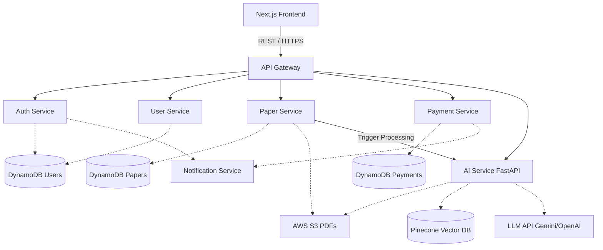

# Scholara - AI-Powered Research Platform Implementation Plan

## Goal Description

Build "Scholara", a modern full-stack AI-powered Research Paper Management and Research Assistant platform. The platform will allow users to browse, purchase, download, and interact with research papers using an AI assistant (RAG architecture). It will also support paper uploads by users, an admin dashboard for moderation and analytics, and a robust microservices backend deployed on AWS.

## Confirmed Architectural Decisions

> [!IMPORTANT]
> The following architectural decisions have been confirmed by the user:
> 1. **Payment Gateway Integration**: **PayHere** will be used for handling payments.
> 2. **OTP/Phone Verification Provider**: **AWS SNS** will be used for phone number verification.
> 3. **AI Model Selection**: **OpenAI API** will be used as the primary LLM provider.

## Open Questions

> [!NOTE]
> 1. **Inter-Service Communication**: For communication between microservices (e.g., `payment-service` notifying `paper-service` to allow download, or `notification-service`), should we use synchronous REST calls (e.g., Spring Cloud OpenFeign) or asynchronous event-driven messaging (e.g., RabbitMQ/Apache Kafka)? *Recommendation: Start with REST for simplicity, introduce Kafka for notifications.*
> 2. **File Processing Asynchrony**: When a user uploads a paper, extracting text, generating embeddings, and storing them in Pinecone can take time. Should this process be asynchronous with a background worker, notifying the user when their paper is "AI Ready"? *Recommendation: Yes, asynchronous processing via the AI service.*

---

## Architecture & Tech Stack

### Frontend (Next.js 15)
- **Framework**: Next.js 15 (App Router)
- **Language**: TypeScript
- **Styling**: Tailwind CSS + Shadcn UI
- **State Management**: Zustand (Global), React Query (Server State/Caching)
- **HTTP Client**: Axios

### Backend (Spring Boot Microservices)
- **Framework**: Spring Boot 3.x, Spring Cloud (Gateway, Netflix Eureka for discovery if needed)
- **Language**: Java
- **Build Tool**: Maven
- **Security**: Spring Security + JWT + BCrypt
- **Services**: `api-gateway`, `auth-service`, `user-service`, `paper-service`, `payment-service`, `notification-service`

### AI Service (FastAPI)
- **Framework**: FastAPI (Python)
- **AI Framework**: LangChain
- **LLM Provider**: Gemini API / OpenAI API
- **Vector DB**: Pinecone

### Database & Storage
- **Primary Database**: AWS DynamoDB (NoSQL)
- **Object Storage**: AWS S3 (PDFs, Profile Pictures)
- **Caching/Session**: Redis (Optional but recommended for single active session control & OTPs)

### Deployment
- **Containerization**: Docker & Docker Compose
- **Cloud**: AWS EC2, S3, DynamoDB

---

## System Architecture & Microservice Communication Flow



---

## Proposed Folder Structure

### Root Repository
```text
scholara/
├── frontend/                 # Next.js Application
├── backend/                  # Spring Boot Microservices
│   ├── api-gateway/
│   ├── auth-service/
│   ├── user-service/
│   ├── paper-service/
│   ├── payment-service/
│   └── notification-service/
├── ai-service/               # FastAPI Application
├── docker-compose.yml        # Local development setup
└── README.md
```

### Frontend (`frontend/`)
```text
src/
├── app/                      # Next.js App Router Pages
│   ├── (auth)/               # login, register, reset-password
│   ├── (dashboard)/          # student and admin dashboards
│   ├── papers/               # paper browsing, details, AI chat
│   └── page.tsx              # Landing Page
├── components/               # Reusable UI components
│   ├── ui/                   # Shadcn UI components
│   ├── layout/               # Header, Footer, Sidebar
│   └── shared/               # Cards, Modals, Forms
├── features/                 # Domain-specific logic & components
│   ├── auth/
│   ├── papers/
│   └── chat/
├── hooks/                    # Custom React hooks (React Query)
├── services/                 # Axios API clients
├── store/                    # Zustand stores
├── types/                    # TypeScript interfaces
└── lib/                      # Utils, constants
```

### Backend Microservice (`backend/{service-name}/`)
```text
src/main/java/com/scholara/{service}/
├── controller/               # REST API Endpoints
├── service/                  # Business Logic
│   └── impl/
├── repository/               # DB Access (DynamoDB mapper)
├── entity/                   # Data Models
├── dto/                      # Request/Response Objects
├── security/                 # JWT Filters, Config (if applicable)
├── config/                   # AWS, DynamoDB, App Configs
└── exception/                # Global Exception Handling
```

### AI Service (`ai-service/`)
```text
app/
├── main.py                   # FastAPI Application Entry
├── api/
│   └── routers/              # API Endpoints (chat, process_pdf)
├── services/
│   ├── rag_service.py        # Core RAG logic
│   └── document_service.py   # PDF processing
├── rag/
│   ├── embeddings.py         # Embedding generation
│   └── vectorstore.py        # Pinecone integration
├── models/                   # Pydantic schemas
└── core/                     # Config, security
```

---

## Database Design (DynamoDB Tables)

1.  **UsersTable**
    -   `PK`: `userId`
    -   Attributes: `email`, `passwordHash`, `role` (STUDENT/ADMIN), `fullName`, `phoneNumber`, `profilePicUrl`, `createdAt`, `activeSessionId`
2.  **PapersTable**
    -   `PK`: `paperId`
    -   Attributes: `title`, `authors` (List), `university`, `abstract`, `keywords` (List), `category`, `s3PdfUrl`, `status` (PENDING/APPROVED), `uploaderId`, `price`, `uploadDate`
3.  **TransactionsTable**
    -   `PK`: `transactionId`
    -   Attributes: `userId`, `paperId`, `amount`, `status`, `paymentDate`
4.  **UploadRequestsTable**
    -   `PK`: `requestId`
    -   Attributes: `paperId`, `userId`, `status`, `requestDate`

---

## Implementation Roadmap

### Phase 1: Foundation & Infrastructure
- Set up monorepo and Git structure.
- Initialize Next.js 15 frontend with Tailwind and Shadcn UI.
- Set up Docker Compose for local DynamoDB and Redis.
- Scaffold backend microservices (Spring Boot) and AI service (FastAPI).
- Configure API Gateway.

### Phase 2: Core Authentication & User Management 
- Implement `auth-service` (JWT, BCrypt, OTP logic, login, register).
- Implement single session enforcement and refresh tokens.
- Frontend: Landing page UI, Auth flows (Login/Register/OTP), Profile page.

### Phase 3: Paper Management & Storage
- Set up AWS S3 integration.
- Implement `paper-service` (CRUD operations for papers, uploading PDFs).
- Frontend: Research Papers browsing, advanced search/filters, Paper upload form.
- Admin dashboard: Approve/reject paper uploads.

### Phase 4: Payment System & Downloads 
- Implement `payment-service` (Stripe integration).
- Secure download mechanisms (presigned S3 URLs valid for limited time).
- Frontend: Payment flow, Download history, Dashboard analytics.

### Phase 5: AI Research Assistant (RAG) 
- Implement FastAPI `ai-service`.
- Pipeline: Extract PDF -> Chunk -> Embed -> Store in Pinecone.
- Chat endpoint: Retrieve from Pinecone -> Prompt LLM -> Return Response.
- Frontend: Interactive Chat UI with typing animations and references.

### Phase 6: Polish & Deployment
- End-to-end testing, bug fixes, UI/UX polish (Loading Skeletons, Toasts).
- Containerize all services with Docker.
- Deploy to AWS EC2.

Let me know if you approve this plan or if you would like to make any adjustments!
